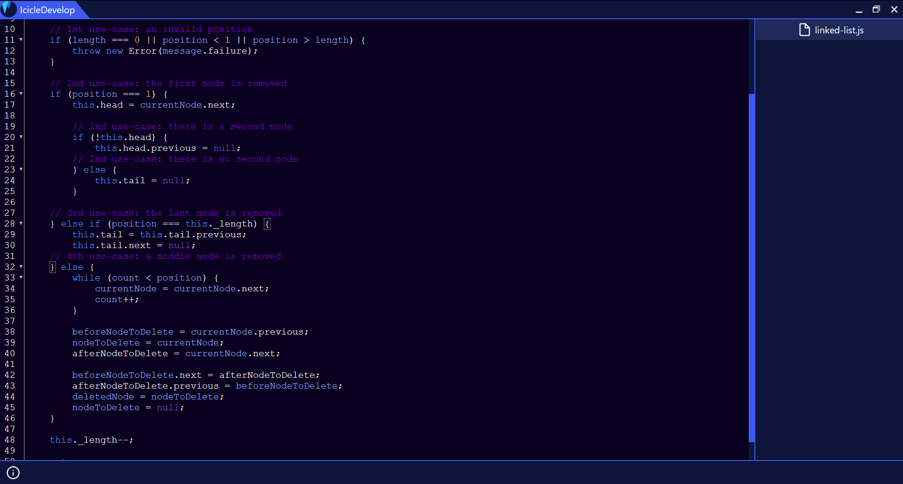

# IcicleDevelop
An open source, cross-platform IDE that provides powerful tools for development. Built upon the [ElectronJS](https://electronjs.org) framework and uses [CodeMirror](https://codemirror.net) for the text editor.

## Ice Cold Development Environment


## Contributing
Helpful contributions are always welcome. Check out [Contributing](Contributing.md) to see how you can contribute. **Read this before opening an issue or pull request.**

## Installing
You can install the compiled program in the [releases page](https://github.com/icedjuro/IcicleDevelop/releases). IcicleDevelop is cross platform and thus can be run on Windows, Mac, or Linux. However, we might not always have the necessary binaries you need for your system. Follow the [compiling instructions](#compiling) and, if you want, email me your built binaries so the community can enjoy.

## Setting up
You're going to need [Node](https://nodejs.org) installed, which comes with npm.

First, in the project directory, run:
```
npm install
```

To start the program, run one of these:  
Running the latter with allow you to access Developer tools.
```
npm run start
```
```
npm run start-dev
```

## Compiling
Note: Developers don't need to compile the program for development, this is if you want a compiled binary.

```
npm run dist:<OS-Name>
```
`<OS-Name>` should be subsituted with `win`, `mac`, or `linux`. If you try to build for a different operating system than the one you are using, it will fail.

All of the targetted built binaries will show up in the dist folder. If you built a binary from a release source, you can email me the binary.

Email: milandjurovic625@gmail.com